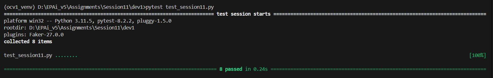

# EPAiV5-Session10 - Lazy Evaluation and Iterator - Iterability in Polygon Module

## Overview
The '**polygons.py**' Python library provides a comprehensive framework for working with regular polygons, which are geometric shapes with equal sides and angles. This library includes two primary classes: '**Polygon**' and '**Polygons**'. The '**Polygon**' class represents a single polygon, defined by the number of sides ('**n**') and the circumradius ('**R**')—the distance from the center to any vertex. The '**Polygons**' class represents a sequence of polygons, all sharing the same circumradius but with varying numbers of sides.

This library is useful for geometric computations, particularly when working with regular polygons. It provides methods to calculate key properties like the interior angle, side length, apothem, area, and perimeter of a polygon. Additionally, the '**Polygons**' class allows you to iterate over a sequence of polygons and find the one with the highest area-to-perimeter ratio, which is often referred to as the polygon with the maximum efficiency.

## Lazy Evaluation
One of the key features of this library is the implementation of lazy evaluation using Python's '**@cached_property**' decorator. Lazy evaluation is a technique that delays the computation of a value until it is actually needed. In other words, the calculation is deferred until the first time the value is accessed. Once computed, the value is cached (stored), so subsequent accesses to that property do not require re-computation—they simply return the cached value.

## Implementation in the Polygon Class
In the '**Polygon**' class, several properties are computationally expensive, meaning they involve calculations that may not be necessary if the property is never accessed. To optimize performance, these properties are implemented using lazy evaluation.

### Cached Properties
The '**Polygon**' class uses the @cached_property decorator to implement lazy evaluation for the following properties:

- '**interior_angle**': Computes the interior angle of the polygon in degrees.
- '**side_length**': Calculates the length of a side of the polygon.
- '**apothem**': Calculates the apothem, which is the distance from the center to the midpoint of any side.
- '**area**': Computes the area of the polygon.
- '**perimeter**': Calculates the perimeter of the polygon.
These properties are only computed when they are first accessed. After the first computation, the result is cached, and subsequent accesses return the cached value, eliminating the need for recalculation. This approach is particularly beneficial in scenarios where multiple properties depend on each other (e.g., '**area**' depends on both '**side_length**' and '**apothem**'), as it avoids redundant calculations.

#### Example of Lazy Evaluation
Consider the following example:


```
from polygons import Polygon

# Create a pentagon with a circumradius of 10 units
pentagon = Polygon(5, 10)

# Access the area property for the first time (triggers computation)
print(f"Area: {pentagon.area} square units")

# Access the area property again (uses cached value, no computation)
print(f"Area (cached): {pentagon.area} square units")

```
In this example, the '**area**' of the pentagon is computed only once, the first time the property is accessed. Any subsequent access to '**pentagon.area**' will return the cached value without recalculating the area.

#### Invalidating the Cache

In some cases, the cached values need to be invalidated when certain attributes of the polygon change (e.g., the number of vertices or the circumradius). The '**_invalidate_cache()**' method is used for this purpose. This method deletes the cached values, ensuring that the properties will be recomputed the next time they are accessed.


```
# Change the number of vertices of the pentagon (invalidates cache)
pentagon.count_vertices = 6

# Access the area property again (triggers recomputation due to cache invalidation)
print(f"Area after change: {pentagon.area} square units")

```
In this case, changing the number of vertices invalidates the cached properties, so the '**area**' is recalculated when accessed again.

### Classes and Methods
#### 1. Polygon Class
The '**Polygon**' class represents a regular polygon with a specified number of sides ('**n**') and a circumradius ('**R**'). It includes several properties and methods to compute the polygon's geometric attributes.

##### Attributes
- '**count_vertices**': Returns the number of vertices (or sides) of the polygon.
- '**count_edges**': Returns the number of edges (which is the same as the number of vertices).
- '**circumradius**': Returns the circumradius of the polygon.
##### Methods
- '**interior_angle()**': Calculates and returns the interior angle of the polygon in degrees.
- '**side_length()**': Computes and returns the length of a side of the polygon.
- '**apothem()**': Calculates and returns the apothem, which is the distance from the center to the midpoint of any side.
- '**area()**': Computes and returns the area of the polygon.
- '**perimeter()**': Calculates and returns the perimeter of the polygon.
- **`__eq__(other)`**: Compares the current polygon with another polygon based on the number of edges and circumradius to determine if they are equal.
- *`*__gt__(other)`**: Compares the current polygon with another polygon to determine if it has more vertices.

##### Usage Example

```
from polygons import Polygon

# Create a hexagon with a circumradius of 10 units
hexagon = Polygon(6, 10)

# Access properties and methods
print(f"Interior Angle: {hexagon.interior_angle} degrees")
print(f"Side Length: {hexagon.side_length} units")
print(f"Area: {hexagon.area} square units")
print(f"Perimeter: {hexagon.perimeter} units")

```

#### 2. Polygons Class
The '**Polygons**' class represents a sequence of regular polygons that share the same circumradius but have varying numbers of sides, ranging from 3 up to a specified maximum (m). This class is iterable, allowing you to loop through each polygon in the sequence.

##### Attributes
- '**max_efficiency_polygon**': Returns the polygon in the sequence with the highest area-to-perimeter ratio.

##### Methods
- **`__len__()`**: Returns the number of polygons in the sequence.
- **`__iter__()`**: Returns an iterator that allows you to iterate over the polygons in the sequence.

##### Usage Example

```
from polygons import Polygons

# Create a sequence of polygons with circumradius 10 and up to 6 sides
polygons = Polygons(6, 10)

# Iterate over the polygons and print their properties
for polygon in polygons:
    print(polygon)

# Find the polygon with the maximum area-to-perimeter ratio
print(f"Max Efficiency Polygon: {polygons.max_efficiency_polygon}")

```

#### 3. PolygonIterator Class
The '**PolygonIterator**' class is an internal class used by the Polygons class to enable iteration. It keeps track of the current polygon in the sequence and stops when all polygons have been iterated over.

##### Methods
- **`__iter__()`**: Returns the iterator itself.
- **`__next__()`**: Returns the next polygon in the sequence or raises a StopIteration exception when all polygons have been iterated over.

## **Test Results**


## Conclusion
The Polygons library provides a powerful yet simple framework for working with regular polygons in Python. It offers easy-to-use methods to calculate essential geometric properties, implements lazy evaluation for efficient computations, and includes an iterator to work with sequences of polygons. This library can be particularly useful in mathematical computations, simulations, and any application requiring precise geometric analysis.

---------------------------------------------------------------------------------------------------------------------------------------------------

**Submission by** - Hema Aparna M

**mail id** - mhema.aprai@gmail.com

---------------------------------------------------------------------------------------------------------------------------------------------------
